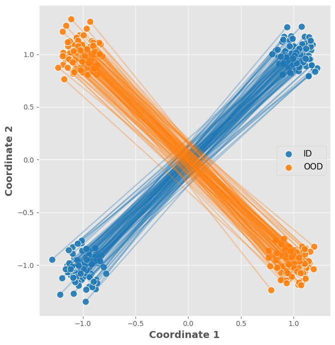
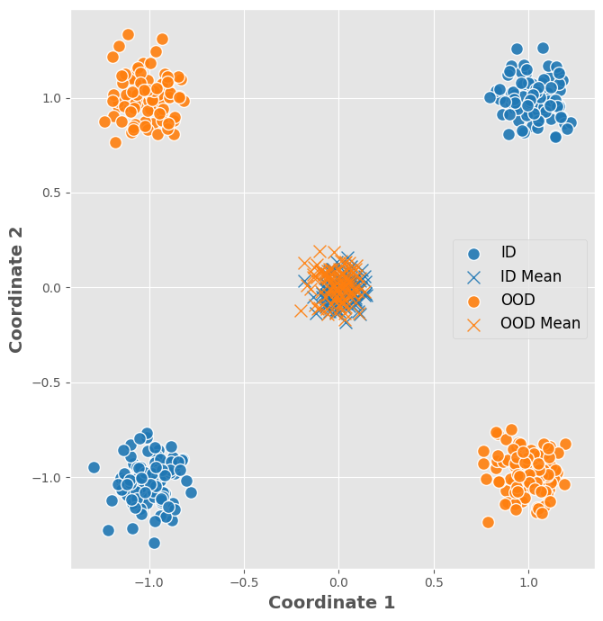
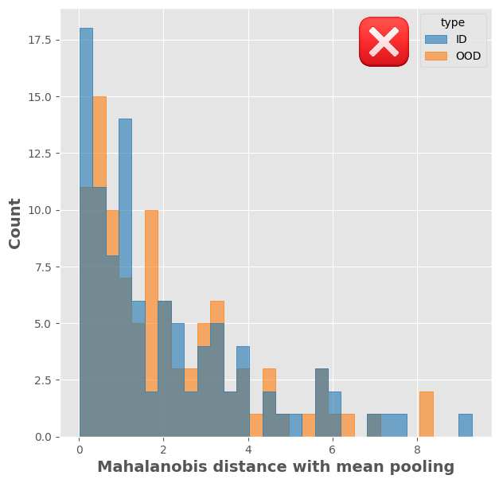
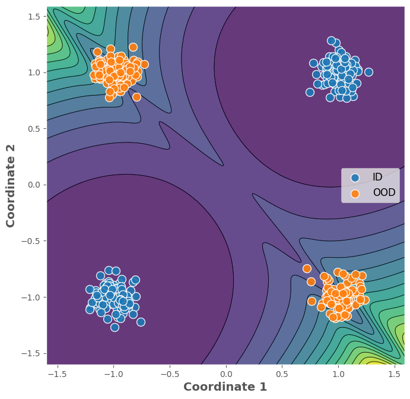
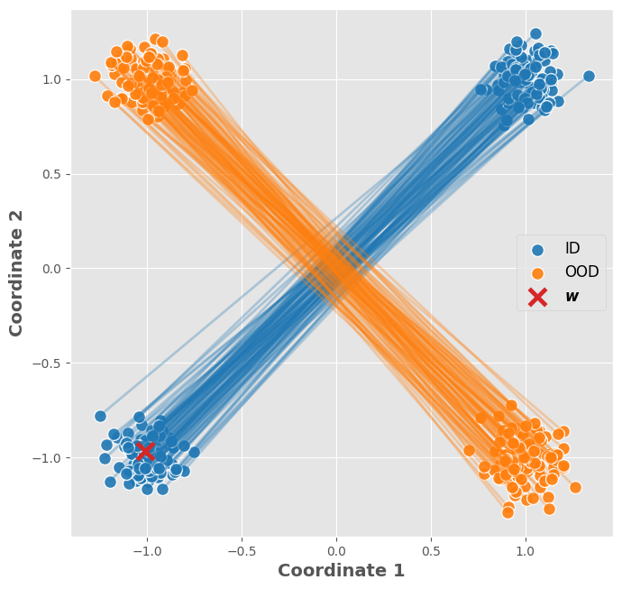
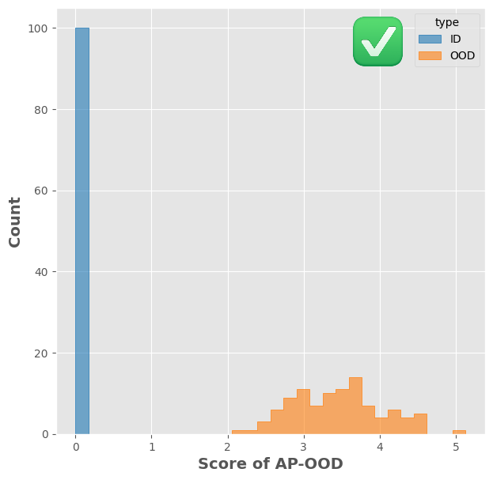

# AP-OOD: Attention Pooling for Out-of-Distribution Detection

_Claus Hofmann<sup>1</sup>, Christian Huber<sup>2</sup>, Bernhard Lehner<sup>2</sup>,_\
_Daniel Klotz<sup>3</sup>, Sepp Hochreiter<sup>1</sup>, Werner Zellinger<sup>4</sup>_

<sup>1</sup> Institute for Machine Learning, JKU LIT SAL IWS Lab, Johannes Kepler University, Linz, Austria  
<sup>2</sup> Silicon Austria Labs, JKU LIT SAL IWS Lab, Linz, Austria\
<sup>3</sup> Interdisciplinary Transformation University Austria, Linz, Austria\
<sup>4</sup> ELLIS Unit, LIT AI Lab, Institute for Machine Learning, JKU Linz, Austria

[](TODO)
[](https://opensource.org/licenses/MIT)

---

This repository contains a generic implementation of our paper "AP-OOD: Attention Pooling for Out-of-Distribution Detection" accepted at **ICLR 2026**. The paper is available [here](TODO). **Instructions to reproduce the experiments can be found in the [Experiments](#Experiments) section.**

## Abstract

Out-of-distribution (OOD) detection, which maps high-dimensional data into
a scalar OOD score, is critical for the reliable deployment of machine learning
models. A key challenge in recent research is how to effectively leverage
and aggregate token embeddings from language models to obtain the OOD
score. In this work, we propose AP-OOD, a novel OOD detection method
for natural language that goes beyond simple average-based aggregation by
exploiting token-level information. AP-OOD is a semi-supervised approach
that flexibly interpolates between unsupervised and supervised settings,
enabling the use of limited auxiliary outlier data. Empirically, AP-OOD
sets a new state of the art in OOD detection for text: in the unsupervised
setting, it reduces the FPR95 (false positive rate at 95% true positives) from
27.84% to 4.67% on XSUM summarization, and from 77.08% to 70.37% on
WMT15 En–Fr translation.

---

<div align="center">
  <table border="0">
    <tr>
      <td colspan="3" align="center">
        <h3>Mean Pooling ❌</h3>
      </td>
    </tr>
    <tr>
      <td align="center" valign="top">
        
        <br />
        </td>
      <td align="center" valign="top">
        
        <br />
        </td>
      <td align="center" valign="top">
        
        <br />
        </td>
    </tr>
    <tr>
      <td colspan="3" align="center">
        <h3>Attention Pooling ✅</h3>
      </td>
    </tr>
    <tr>
      <td align="center" valign="top">
        
        <br />
        </td>
      <td align="center" valign="top">
        
        <br />
        </td>
      <td align="center" valign="top">
        
        <br />
        </td>
    </tr>
  </table>
</div>

## Installation

Install AP-OOD via PIP:

```
pip install git+https://github.com/ml-jku/ap-ood.git
```

## Quickstart

This is a guide to get you started with AP-OOD. For examples on specific data sets, see [Examples](#Examples). AP-OOD is implemented as a PyTorch module. You can use it as follows:

```
import torch
from ap_ood import APOOD

feature_dim = 1024

model = APOOD(
    feature_dim=feature_dim,
    n_heads=128,
    n_queries=2,
    beta=1.,
    similarity='dot',
)

# Batch of 512 sequence representations with 512 tokens and 1024 features
tokens = torch.randn(512, 512, feature_dim)
mask = torch.ones([512, 512])

d = model(tokens, mask)
```

AP-OOD can be trained like any PyTorch model (The Adam optimizer is recommended):

```
optimizer = torch.optim.Adam(model.parameters(), lr=0.01)

for tokens, mask in dataloader:
   optimizer.zero_grad()
   
   # Forward pass
   d = model(tokens, mask)
   
   # Compute loss
   loss = torch.mean(d, dim=0)
   
   # Backward pass and optimize
   loss.backward()
   optimizer.step()
```
   
After AP-OOD was trained, please use ``model.partial_fit_mean`` to fit the mean using the mini-batch attention pooling process:

```
for tokens, mask in dataloader:
   model.partial_fit_mean(tokens, mask)
```

To get the distances of a batch of sequences, just pass the sequences to the model. **Don't forget to call model.eval() before running inference!**

```
model.eval()
with torch.no_grad():
    d = model(tokens, mask)
```

## Examples

| Notebook | Topic | Description |
| :--- | :--- | :--- |
| 📓 [**Example 1**](notebooks/1_mil_example.ipynb) | **MIL / MUSK** | OOD detection for multiple instance learning on the MUSK data set |
| 📓 [**Example 2**](notebooks/2_nlp_example.ipynb) | **NLP / XSUM** | OOD detection for language modeling: Text summarization |

### Example 1: OOD detection for multiple instance learning (MIL) on the MUSK data set

This example demonstrates the OOD detection capabilities of AP-OOD on the [**MUSK dataset**](https://archive.ics.uci.edu/dataset/74/musk+version+1):

#### Dataset Description
> This dataset describes a set of 92 molecules of which 47 are judged by human experts to be musks and the remaining 45 molecules are judged to be non-musks.  The goal is to learn to predict whether new molecules will be musks or non-musks.  However, the 166 features that describe these molecules depend upon the exact shape, or conformation, of the molecule.  Because bonds can rotate, a single molecule can adopt many different shapes.  To generate this data set, the low-energy conformations of the molecules were generated and then filtered to remove highly similar conformations. This left 476 conformations. Then, a feature vector was extracted that describes each conformation.
>
> This many-to-one relationship between feature vectors and molecules is called the "multiple instance problem".  When learning a classifier for this data, the classifier should classify a molecule as "musk" if ANY of its conformations is classified as a musk.  A molecule should be classified as "non-musk" if NONE of its conformations is classified as a musk.

### Example 2: OOD detection for language modeling: Text summarization on the XSUM data set

This example demonstrates the OOD detection capabilities of AP-OOD on the [**XSUM dataset**](https://huggingface.co/datasets/EdinburghNLP/xsum) using the [**Pegasus-XSUM**](https://huggingface.co/google/pegasus-xsum) model:

#### Dataset Description
The XSUM dataset is a summarization dataset that consists of BBC articles and their corresponding summaries. The dataset is widely used for evaluating text summarization models.

# Experiments

The experiments are located in a separate package (`ap_ood_experiments`). To run the experiments, we recommend setting up a Python environment with Anaconda:

## Installation

- The experimental code works best with Anaconda ([download here](https://www.anaconda.com/download)). 
  To install the experimental library and all dependencies, run the following commands:

```
  conda env create -f experiments/environment.yml
  conda activate ap-ood
  pip install -e ./experiments
```

## Weights and Biases

- AP-OOD supports logging with Weights and Biases (W&B). By default, W&B will log all metrics in [anonymous mode](https://docs.wandb.ai/guides/app/features/anon). Note that runs logged in anonymous mode will be deleted after 7 days. To keep the logs, you need to [create a W&B account](https://docs.wandb.ai/quickstart). When done, login to your account using the command line.

## Data Sets
To run, you need the following data sets. We follow the benchmark from [Ren et al. (2023)](https://arxiv.org/abs/2209.15558).

The location of the data sets and other environment variables is managed via a `.env` file: Copy the `.env.examples` file located in the root directory of the repository. Name the newly created file `.env`. Customize the new file to contain the paths to the data sets on your machine.

### In-Distribution Data Sets

  * [XSUM](https://huggingface.co/datasets/EdinburghNLP/xsum): Automatically downloaded from HuggingFace
  * [WMT15 En--Fr](https://huggingface.co/datasets/wmt/wmt15): Automatically downloaded from HuggingFace

### Auxiliary Outlier Data Set

  * [C4](https://huggingface.co/datasets/allenai/c4): Automatically downloaded from HuggingFace
  * [ParaCrawlv9](https://opus.nlpl.eu/ParaCrawl/en&fr/v9/ParaCrawl): Download it from the link (format bilingual-moses), extract it, and link the environment variable `PARACRAWL_ROOT` to the location of the extracted file.


### Out-of-Distribution Test Data Sets

The OOD test data for the summarization task consists of:

* [CNN/Daily Mail](https://huggingface.co/datasets/abisee/cnn_dailymail): Automatically downloaded from HuggingFace
* [Lil-Lab Newsroom](https://huggingface.co/datasets/lil-lab/newsroom): The dataset is managed from HuggingFace, but you need to download the data manually. Download the data set and set the environment variable `NEWSROOM_ROOT` to the location of the extracted files. 
* [Reddit-TIFU](https://huggingface.co/datasets/ctr4si/reddit_tifu): Automatically downloaded from HuggingFace
* [Samsum](https://huggingface.co/datasets/Samsung/samsum): Automatically downloaded from HuggingFace

The OOD test data for the translation task consists of the following data sets. For the Opus data sets, create a new directory for the data set and set the environment variable `OPUS_ROOT` to the location of the directory.

* [Newstest14](https://www.statmt.org/wmt15/translation-task.html) Download the development sets from the link and set the environment variable `WMT_DEV_ROOT` to the location of the extracted files.
* [Newsdiscussdev2015](https://www.statmt.org/wmt15/translation-task.html) Download the development sets from the link and set the environment variable `WMT_DEV_ROOT` to the location of the extracted files.
* [Newsdiscusstest2015](https://www.statmt.org/wmt15/translation-task.html) Download the test sets from the link and set the environment variable `WMT_TEST_ROOT` to the location of the extracted files.
* [Opus-Law](https://opus.nlpl.eu/ELRC-EUIPO_law/en&fr/v1/ELRC-EUIPO_law) Download the data set (format bilingual-moses) from the link and place it in `OPUS_ROOT` in the subdirectory `law`.
* [Opus-Medical](https://opus.nlpl.eu/EMEA/en&fr/v3/EMEA) Download the data set (format bilingual-moses) from the link and place it in `OPUS_ROOT` in the subdirectory `medical`.
* [Opus-Koran](https://opus.nlpl.eu/Tanzil/en&fr/v1/Tanzil) Download the data set (format bilingual-moses) from the link and place it in `OPUS_ROOT` in the subdirectory `Koran`.
* [Opus-IT](https://opus.nlpl.eu/Ubuntu/en&fr/v14.10/Ubuntu) Download the data set (format bilingual-moses) from the link and place it in `OPUS_ROOT` in the subdirectory `it`.
* [Opus-Subtitles](https://opus.nlpl.eu/OpenSubtitles/en&fr/v2018/OpenSubtitles) Download the data set (format bilingual-moses) from the link and place it in `OPUS_ROOT` in the subdirectory `subtitles`.

## How to Run

### Summarization

1. Set the environment variable `EMBEDDING_ROOT` to the location where you want to store the language model embeddings.
2. To create the input and output embeddings for text summarization, run the command
   ```
   python -m ap_ood_experiments.create_embeddings -cn summarization-pegasus-xsum --multirun embedding_type=INPUT,OUTPUT
   ```
3. To run the unsupervised method on the input and output, run
   ```
   python -m ap_ood_experiments.run_methods -cn summarization-pegasus-xsum-input method=ap-ood
   python -m ap_ood_experiments.run_methods -cn summarization-pegasus-xsum-output method=ap-ood
   ```
4. To run the supervised method on the input and output, run
   ```
   python -m ap_ood_experiments.run_methods -cn summarization-pegasus-xsum-input method=ap-ood-oe
   python -m ap_ood_experiments.run_methods -cn summarization-pegasus-xsum-output method=ap-ood-oe
   ```


### Translation

1. Set the environment variable `WMT_MODEL_CHECKPOINT` to the location where you want to store the model checkpoints.
2. Set the environment variable `EMBEDDING_ROOT` to the location where you want to store the language model embeddings.
3. Train the translation model
   ```
   python -m ap_ood_experiments.transformer.train_wmt
   ```
4. To create the input and output embeddings for translation, run the command
   ```
   python -m ap_ood_experiments.create_embeddings -cn translation-transformer-wmt --multirun embedding_type=INPUT,OUTPUT
   ```
5. To run the unsupervised method on the input and output, run
   ```
   python -m ap_ood_experiments.run_methods -cn translation-transformer-wmt-input method=ap-ood
   python -m ap_ood_experiments.run_methods -cn translation-transformer-wmt-output method=ap-ood
   ```
6. To run the supervised method on the input and output, run
   ```
   python -m ap_ood_experiments.run_methods -cn translation-transformer-wmt-input method=ap-ood-oe
   python -m ap_ood_experiments.run_methods -cn translation-transformer-wmt-output method=ap-ood-oe
   ```

